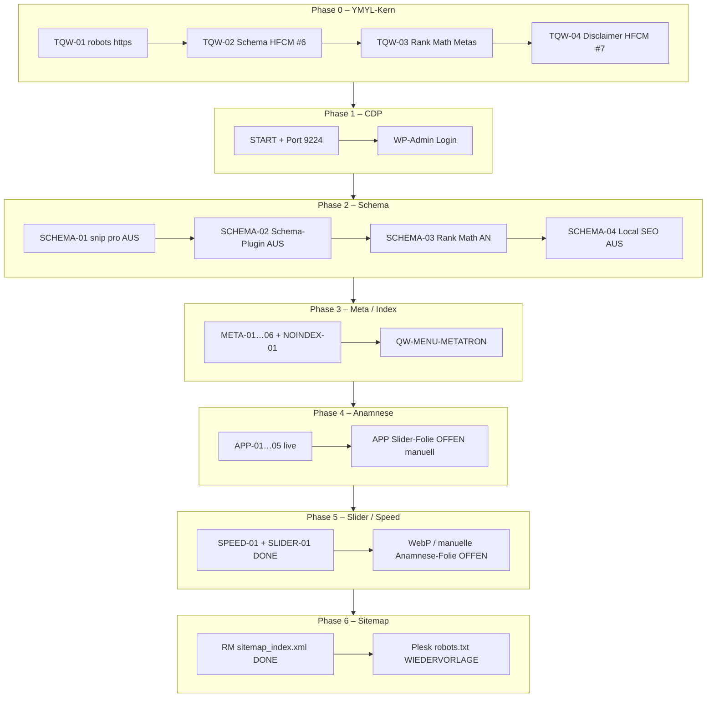
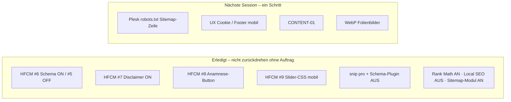

# TAGESABSCHLUSS – Direktive 2026-08-14

**Fixiert:** 2026-08-14 23:42 CEST  
**Direktive-Name:** `Tagesabschluss`  
**Domain:** https://rauch-heilpraktiker.de  
**Repo (Massgabe):** https://github.com/redshift-three67/naturheilpraxis-eeat · Branch `main`  
**Checkpoint-Basis:** `063ebe9` (Stand vor diesem Dokument) · **dieser Commit ist der Wiederherstellungspunkt**  
**CDP dieser Session:** `127.0.0.1:9224` · Profil `/tmp/chrome-rauch-heilpraktiker-cdp`  
**Nicht anfassen:** Ports `9223` (Lovable), `9225` (Sunclinic)

---

## 0. Was diese Direktive festlegt

1. GitHub `main` ist die alleinige Referenz.  
2. Nächste Session startet **nur** mit `docs/session/PROMPT-FORTSETZUNG.md`.  
3. Wiederherstellung: `archive/2026-08-14/CHECKPOINT-2026-08-14.md`.  
4. Offene Arbeit nur nach `docs/PLAN.md` und `docs/WORKFLOW.md` (ein Live-Schritt).  
5. YMYL/HWG: keine Heilversprechen; HFCM #6 Schema und #7 Disclaimer bleiben.

---

## 1. Phasen – tabellarisch

### Phase 0 – Pflichtkern (vor dieser Session)

| Schritt | Inhalt | Status |
|---------|--------|--------|
| TQW-01 | robots Sitemap-Zeile **https** | done |
| TQW-02 | HFCM #6 MedicalClinic+Physician | done |
| TQW-03 | Rank Math Metas Top-Seiten | done |
| TQW-04 | HFCM #7 Disclaimer+Autor | done |

### Phase 1 – Session-Start / CDP

| Schritt | Inhalt | Status |
|---------|--------|--------|
| START | git pull, Handoff gelesen, Live vs Repo | done |
| CDP | Port **9224** exklusiv | done |
| LOGIN | WP-Admin Redshift-Three / Anzeige Administrator | done |

### Phase 2 – Schema-Systeme

| Schritt | Inhalt | Status |
|---------|--------|--------|
| SCHEMA-01 | snip pro aus · JSON-LD 7→2 | done |
| SCHEMA-02 | Schema-Plugin aus · JSON-LD 2→1 (nur HFCM) | done |
| SCHEMA-03 | Rank Math `seo-by-rank-math` an · Metas wieder im HTML | done |
| SCHEMA-04 | Rank-Math-Modul Lokales SEO aus · kein HealthAndBeautyBusiness | done |

### Phase 3 – Titel / Meta / Index

| Schritt | Inhalt | Status |
|---------|--------|--------|
| META-01 | NLS-Titel ohne „Metatron Hospital“ | done |
| NOINDEX-01 | EAV 5430 + BIT 717 wieder `follow, index` | done |
| META-02 | Umlaute + BIT „Ganzheitlich“ | done |
| META-03 | NLS-Keywords ohne Metatron Hospital/Hunter | done |
| META-04–06 | Werbetitel und Claim-Metas bereinigt | done |
| QW-MENU-METATRON | Menülabel NLS ohne Hospital; Top „Rauch“ nach Fehlklick restored | done |

### Phase 4 – Patient-App / Anamnese

| Schritt | Inhalt | Status |
|---------|--------|--------|
| APP-01 | Footer-Menü `topmenu` (39) Custom-Link | done |
| APP-02 | Slider-Folie leer → **Rollback**; HFCM #8 Leiste | done |
| APP-03 | Footer-Reihenfolge nach Kontakt; Submenü nach „Praxis offen“ | done |
| APP-04 | Leiste unter „Jetzt Termin buchen“ + ProvenExpert | done |
| APP-05 | Button-Stil wie Termin-Karte, kleiner, zweizeilig | done |
| APP-05-Slider | Anamnese als Slider-Folie | **offen (manuell YOOtheme)** |

### Phase 5 – Slider / Speed

| Schritt | Inhalt | Status |
|---------|--------|--------|
| SPEED-01 | HFCM #9: Kenburns mobil aus, Höhe ~388px | done |
| SLIDER-01 | Untertitel ohne „Sanft Heilen“; Psych-CTA → `/psychotherapie-augsburg/` | done |
| SPEED-02 | Folienbilder WebP/Kompression | offen |
| SLIDER-Anamnese | eine Folie manuell | offen |

### Phase 6 – Sitemap / Betrieb

| Schritt | Inhalt | Status |
|---------|--------|--------|
| QW-SITEMAP A | Rank Math Sitemap-Modul **ON** · `sitemap_index.xml` 200 | done |
| QW-SITEMAP B | Live-`robots.txt` auf `sitemap_index.xml` | **Wiedervorlage Plesk** (physische Root-Datei) |

### Phase 7 – Noch offen (nächste Sessions)

| ID | Inhalt | Priorität |
|----|--------|-----------|
| PLESK-ROBOTS | Root-`robots.txt` Zeile `Sitemap: https://rauch-heilpraktiker.de/sitemap_index.xml` | hoch |
| UX-01 | ~~Footer-Legal auf XS sichtbar~~ HFCM #10 2026-08-15 | done |
| UX-02 | ~~Cookie-Banner First Screen~~ HFCM #10 2026-08-15 | done |
| QW-SPEED-PLUGINS | Async JS + Speed Booster nach SPEED-01 testen | mittel |
| QW-NOINDEX-PLUGIN | 0/110 Regeln – deinstallieren | niedrig |
| QW-TITELCASE | Rank Math „Titel großschreiben“ | niedrig |
| CONTENT-01 | Therapie-Seiten E-E-A-T | mittel |
| KONTAKT-APP | ein Satz + Anamnese-Link auf Kontakt | niedrig |

---

## 2. Mermaid – Phasen und Schritte

---

## 3. Live-Kern nach Abschluss

| Artefakt | Live |
|----------|------|
| Schema Praxis | 1× HFCM #6 MedicalClinic+Physician = Repo-Snippet |
| Disclaimer | HFCM #7 sitewide |
| Rank Math | Plugin ON · Local SEO OFF · Sitemap-Modul ON |
| JSON-LD Home | HFCM-Graph + RM Organization/WebSite/WebPage/Person |
| Metas Top-Seiten | im HTML, `follow, index` (EAV/BIT nach NOINDEX-01) |
| Anamnese | `https://naturheilpraxis-rauch.lovable.app/` Button + Menüs |
| Slider | 4 Folien; Untertitel ohne „Sanft Heilen“; Psych-CTA korrekt |
| Speed mobil | Kenburns aus; Sliderhöhe ~388px |
| robots.txt öffentlich | noch `Sitemap: https://…/sitemap.xml` |
| Rank Math Sitemap | `https://rauch-heilpraktiker.de/sitemap_index.xml` |

---

## 4. Dateien für die nächste Session

| Datei | Rolle |
|-------|--------|
| `docs/session/PROMPT-FORTSETZUNG.md` | **1:1-Prompt** |
| `docs/session/TAGESABSCHLUSS-2026-08-14.md` | diese Direktive |
| `archive/2026-08-14/CHECKPOINT-2026-08-14.md` | Restore |
| `docs/PLAN.md` | offene Reihenfolge |
| `docs/WORKFLOW.md` | Prewrite → ein Schritt → Verify |

---

*Ende TAGESABSCHLUSS. Keine stillen Writes nach diesem Fix.*
